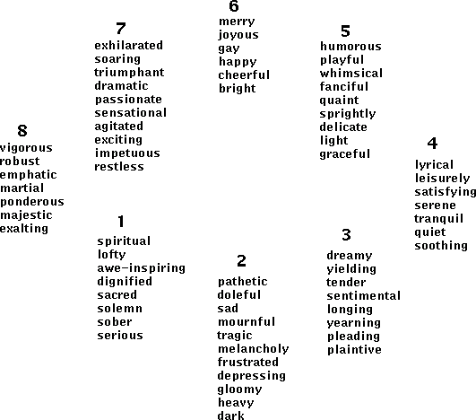

# Hevner's mood wheel categorizes moods in music

[Mood]

The mood wheel is read anti-clockwise, where each opposing side on the diagram are contrasts in mood.
Music within categories are broken down as such:

Categories 2-7 has some of the more mixed qualities - being slightly more supportive & challenging, used to widen the qualities of what one person can tolerate.

Music within categories 3-6 are the least challenging & most supportive, being the safest to use with sufferers of trauma &/or psychosis, reinforcing the positive feelings someone could have.
